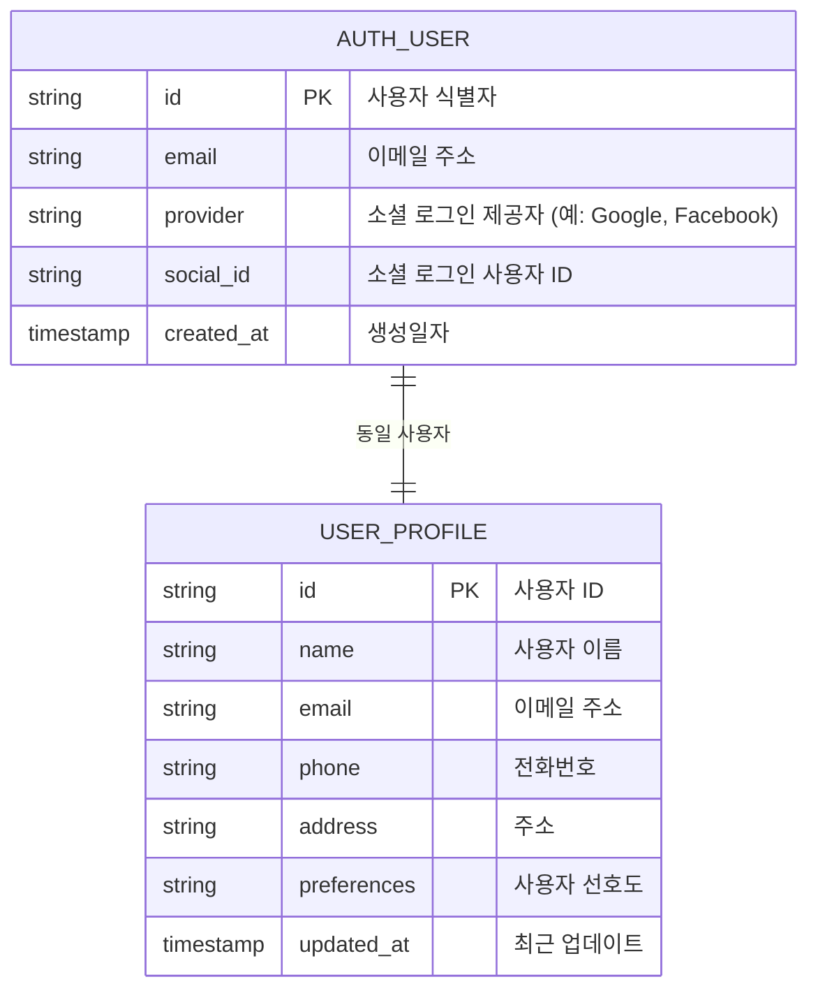

# auth_service
Auth services for The Tree Project

## ERD

```mermaid
erDiagram
    %% Auth 서비스 데이터베이스 (Social Login 기반)
    AUTH_USER {
      string id PK "사용자 식별자"
      string email "이메일 주소"
      string provider "소셜 로그인 제공자 (예: Google, Facebook)"
      string social_id "소셜 로그인 사용자 ID"
      timestamp created_at "생성일자"
    }
    
    %% User 서비스 데이터베이스
    USER_PROFILE {
      string id PK "사용자 ID"
      string name "사용자 이름"
      string email "이메일 주소"
      string phone "전화번호"
      string address "주소"
      string preferences "사용자 선호도"
      timestamp updated_at "최근 업데이트"
    }
    
    %% 논리적 관계 (각 서비스의 DB는 독립적이므로 물리적 FK 제약은 없음)
    AUTH_USER ||--|| USER_PROFILE : "동일 사용자"
```
